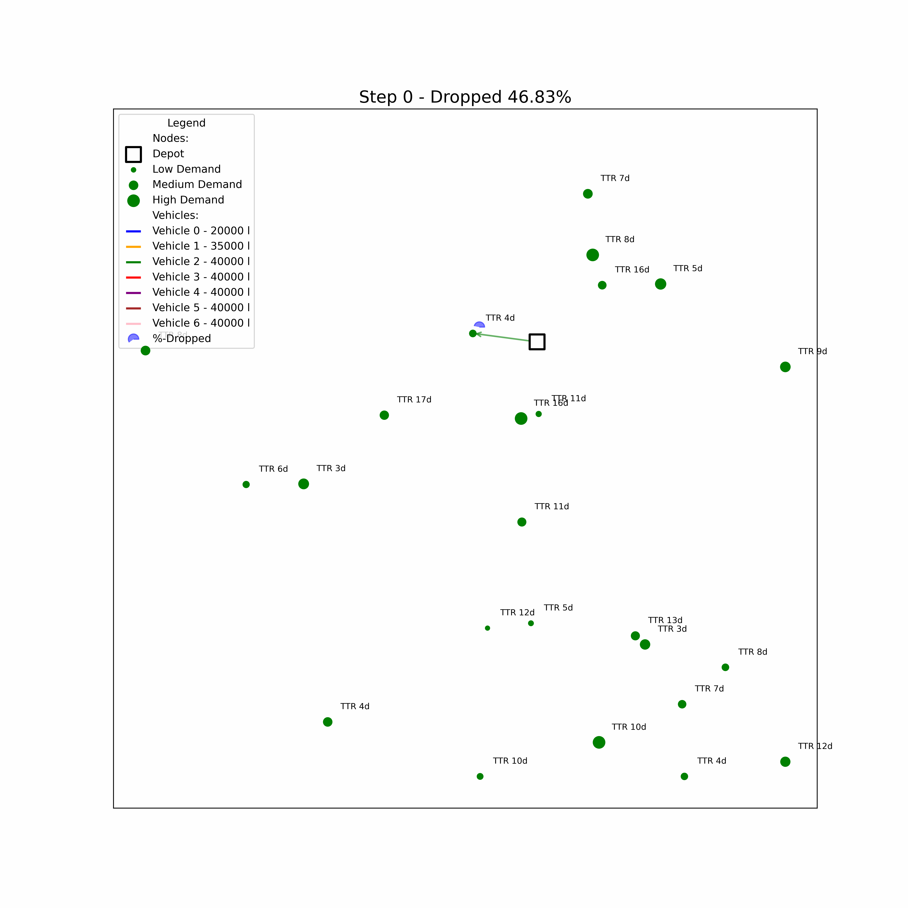

# Petra2dplus



**Petra2dplus** is a research codebase for solving the petrol station replenishment problem (Petra) using deep reinforcement learning with attention-based neural architectures. The code is supporting both synthetic and real-world data, and integrates with Weights & Biases (wandb) for experiment tracking.

---

## Overview

This repository implements a deep RL approach to the **Petra** problem, where the goal is to optimize the replenishment of petrol stations using a fleet of vehicles under various constraints (capacity, time, cost, etc.). The codebase is modular and supports the Petra problem.

- **Attention-based Model:** Uses a transformer-like architecture for sequential decision making.
- **RL Algorithms:** Supports REINFORCE (incl Baselines) and GRPO.
- **Wandb Integration:** For experiment tracking, logging, and artifact management.
- **GIF Visualization:** Generates and logs GIFs of solutions for qualitative analysis.
- **Extensive CLI Options:** Highly configurable via command-line arguments.

---

## Installation

1. **Clone the repository:**
   ```bash
   git clone https://github.com/hannohiss/Petra2dplus.git
   cd Petra2dplus
   ```

2. **Install dependencies:**
   - The project uses [pixi](https://prefix.dev/docs/pixi/) for environment management. Install pixi, then run:
     ```bash
     pixi install
     ```
   - Alternatively, set up a Python 3.11+ environment and install requirements manually (see `pixi.toml` for dependencies).

3. **(Optional) Set up wandb:**
   - Create a [wandb](https://wandb.ai/) account and login with `wandb login`.

---

## Project Structure

```
Petra2dplus/
│
├── run.py                # Main training script
├── train.py              # Training and validation loops
├── eval.py               # Evaluation script for trained models
├── generate_data.py      # Script to generate synthetic datasets
├── options.py            # Command-line argument parsing and configuration
│
├── nets/                 # Neural network architectures (attention, critic, etc.)
├── problems/             # Problem definitions and generators (Petra)
│   └── petra/            # Petra-specific environment and dataset logic
├── utils/                # Utility functions (logging, data, tensor ops, etc.)
├── src/                  # Data adapters and integration code
│
├── outputs/              # Model checkpoints and results
├── gif_outputs/          # Generated GIFs for visualization
├── frames/               # Intermediate frames for GIFs
├── wandb/                # wandb logs and artifacts
│
├── pixi.toml             # Environment and dependency specification
├── .gitignore
└── README.md
```

---

## Usage

### Training

To train a model on the Petra problem:

```bash
python run.py --problem petra --graph_size 20 --veh_num 3 --n_epochs 50 --use_wandb --use_grpo
```

**Key options:**
- `--problem`: `petra` (hcvrp is deprecated)
- `--graph_size`: Number of stations/customers
- `--veh_num`: Number of vehicles
- `--n_epochs`: Number of training epochs
- `--use_wandb`: Enable wandb logging
- `--use_grpo`: Enable GRPO training

All options are defined in `options.py`. Also check the `launch.json` for configurations.

### Evaluation

To evaluate a trained model:

```bash
python eval.py --val_size 1000 --eval_batch_size 256
```

You can also use the `--data_adapter` flag to evaluate on real-world data. (not in this repo)

## Petra Problem Details

The **Petra** problem is a real-world inspired vehicle routing task where the agent must decide:

- Which petrol station to replenish
- Which vehicle to use
- How much to deliver (fulfilment)

**Constraints and Features:**
- Action masking for visited stations, empty/timed-out vehicles
- Multi-trip and time window support
- Cost and reward functions configurable (see `options.py`)
- See `problems/petra/help.md` for more details on actions and episode termination.

---

## Acknowledgements

- Built on top of [2D-Ptr](https://github.com/farkguidao/2D-Ptr) attention-based RL for combinatorial optimization.

---